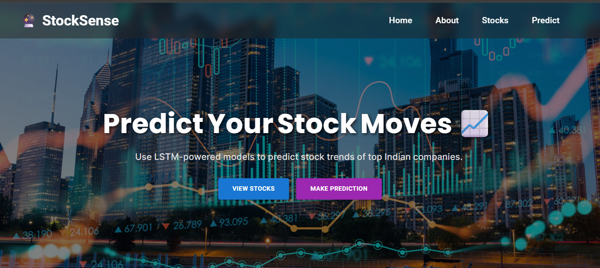
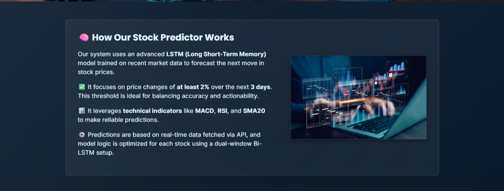
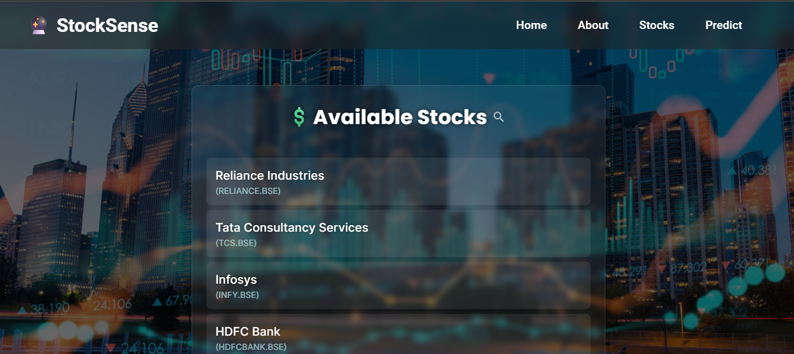
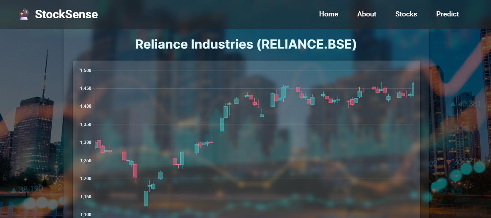
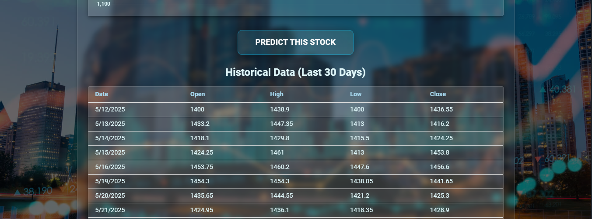
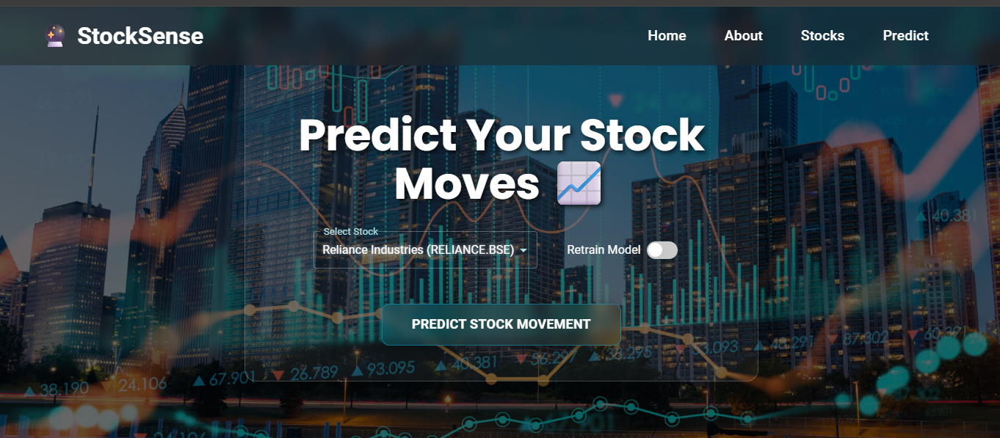
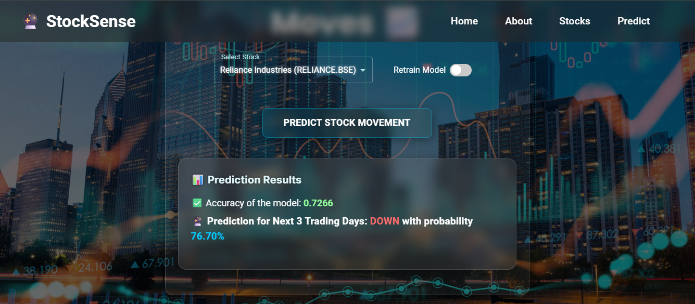

# 📈 Stock Movement Prediction Web App

This is a full-stack web application that predicts **stock price movements** for top Indian stocks using **Bi-directional LSTM deep learning models**. Built with **Vite-React (frontend)** and **FastAPI (backend)**, this app empowers users with intuitive candlestick charts and actionable predictions (UP/DOWN) for informed decision-making.

---

## 🚀 Key Features

### 🌐 Frontend (React)
- ✅ Fully responsive design using **Material UI (MUI)**
- ✅ Animated landing page built with **Framer Motion**
- ✅ Interactive **candlestick charts** (last 30 days) using `chartjs-chart-financial` to visualize historical price action.
- ✅ Stylish, blur-effect navbar and smooth hover animations for an engaging user experience.
- ✅ Clear routing for the main application pages: `/` (Home), `/stocks` (Stock List), and `/predict` (Prediction Form).

### 🧠 Backend (FastAPI)
- ✅ **High-Performance API Endpoints:** Built with FastAPI to provide fast and efficient real-time predictions using pre-trained models.
- ✅ **Dynamic Data Fetching:** Capable of fetching live or utilizing cached historical stock data to ensure up-to-date information.
- ✅ **Efficient Model Handling:** Manages the loading and caching of specialized `MinMaxScaler` objects and `Bi-directional LSTM` models from a local directory for rapid inference.
- ✅ **Streamlined Prediction Logic:** Focuses purely on input preprocessing, model inference, and output thresholding for quick responses.
### 🔍 Prediction Details

- **Prediction Goal:** To classify the next 3-day stock price movement as either `UP` or `DOWN`.
- **Model Architecture**: **Bidirectional LSTM (Bi-LSTM)** neural network.
    * Processes sequence data in both forward and backward directions.
    * Layers: Input layers, multiple Bi-LSTM layers, dense layers, and a `sigmoid` output layer.
    * Model uses dual inputs (short/long windows) to capture distinct market dynamics for robust trend prediction.
    * A short window analyzes immediate price volatility; a long window reveals broader, underlying market trends.
    * Combining these different timeframes significantly enhances the model's ability to forecast future stock movements.
- **Input Features**: 
    * `Close`, `MACD`, `RSI`, `SMA20`
- **Output**: Probability between 0 and 1 -> Translated into `UP` or `DOWN` using threshold `0.02`.
- **Future Days**: Predicts stock price movement for the next 3 days.

---

## 🧠 ML Pipeline & Training

### 1. Data Acquisition
* Uses `data_loader.py` to fetch historical stock data.

### 2. Feature Engineering & Preprocessing
* Calculates indicators, drops NaNs, creates target labels.
* Applies `MinMaxScaler` and generates LSTM sequences.

### 3. Class Imbalance Handling
* Uses **`SVMSMOTE`** for oversampling minority class.
  
### 4. Model Training
* Built with TensorFlow/Keras.
* Saved to `.h5` and `.pkl` files under `backend/models/`.

### 5. Real-time Inference (FastAPI `/predict`)
* Loads pre-trained model and scaler.
* Prepares input, predicts, applies threshold, returns result.

---

## 🏗️ Project Structure

```
stock_predictor/
├── README.md
├── .gitignore
├── backend/
│   ├── main.py
│   ├── requirements.txt
│   ├── app/
│   │   ├── config.py
│   │   ├── data_loader.py
│   │   ├── diagnostics.py
│   │   ├── model.py
│   │   ├── sequencer.py
│   │   ├── utils.py
│   ├── models/                
│   │   ├── AXISBANK_BSE.h5
│   │   ├── AXISBANK_BSE_scaler.pkl
│   │   ├── ... (other 25+ stock models and scalers)
├── frontend/
│   ├── index.html
│   ├── package.json
│   ├── vite.config.js
│   ├── jsconfig.json
│   ├── src/           
│   │   ├── App.css
|   |   ├── App.jsx
|   |   ├── main.jsx
│   │   └── public/
│   │       ├── stocks-6.jpg
|   |   ├── pages/
|   |       ├── Home.jsx
|   |       ├── Predict.jsx
|   |       ├── StockDetail.jsx
|   |       ├── StockList.jsx
|   |   ├── components/
|   |       ├── Navbar.jsx
|   |       ├── custom/
|   |           ├── Navbar.css
|   |   ├── api/
|   |       ├── config.js


```

---

## 📦 Setup Instructions

### 1. Clone the Repo

```bash
git clone (https://github.com/Yaswanth-Kalla/StockSense.git)
cd StockSense
```

### 2. Backend (FastAPI)

```bash
cd backend
pip install -r requirements.txt
uvicorn app.main:app --reload
```

### 3. Frontend (React)

```bash
cd frontend
npm install
echo "VITE_API_URL=http://127.0.0.1:8000" > .env
npm run dev
```


---


## 📸 Screenshots

1. 🏠 Home Page
   
    
    

   
2. 📋 Stock List

    


3. 📊 Stock Detail with Candlestick Chart
    
    
    

   
4. 🔮 Prediction Form
    
    


---


## 🌍 Deployment

### Backend (Render or Railway)
- Deploy with `uvicorn app.main:app --host=0.0.0.0 --port=PORT`
- Ensure `/models/` folder is uploaded

### Frontend (Netlify or Vercel)
- Set `VITE_API_URL` in environment variables
- Build command: `npm run build`
- Publish directory: `dist/`

---

## 📊 API Endpoints

| Method | Route              | Description |
|--------|-------------------|-------------|
| GET    | /stocks           | List available stock symbols |
| GET    | /stocks/{stock}   | Get candlestick + table data |
| POST   | /predict          | Predict stock movement |

---

## 📁 Model Storage

- Local: Store models in `backend/models/`
- Cloud: Use persistent volumes, AWS S3, or Render storage

---

## 🧪 Testing

Test backend APIs via Swagger:

```url
http://127.0.0.1:8000/docs
```

---

## 📬 Contact

📧 yaswanthkalla4444@gmail.com

🔗 [LinkedIn](https://www.linkedin.com/in/yaswanth-kalla-85534626b)

